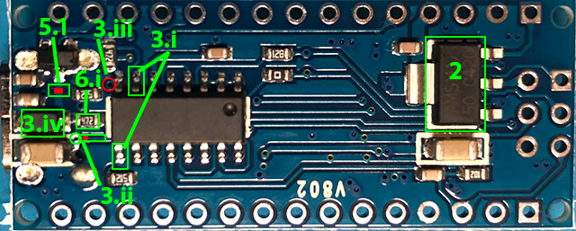

# Arduino Nano Low Power Sleep Mode Test

Tiny sketch to put the Arduino Nano into sleep mode, so you can test the
quiescent current of the module, after blinking its LED a few times to
let you know that it isn't just dead but sleeping.

This can be run with the bare module connected to a USB with nothing
else needed for the test, other than the ability to measure the current
it is drawing from the USB. This is a good test to run on a module
before wiring it into a project requiring low current draw in sleep
mode. :smirk:

Not all Arduino modules on AliExpress are made equal, as I discovered.
Some have genuine AT328p chips, have some clones and others have cloned
AT328p and an unmarked `CH340`/`FT230` like clone USB driver chips that
draw 4mA all on their own, whether the USB cable is connected or not. I
say 'like' because these don't match the pin-out of either genuine
chips, and being totally unmarked make it hard to find their datasheet
or pin-out.

This discovery motivated me down a rabbit hole for a few days trying to
make this module sleep, while drawing less than a 100µA. I was able to
get 80-90µA on an Arduino Pro Mini clone, with genuine AT328p and no USB
driver.

Contrary to claims on some forums where the issue was discussed and
heatedly debated, the problem boiled down to the unmarked USB driver and
not the cloned AT328p MCU. I replaced the MCU on one module, with a
genuine AT328p, and the current draw did not budge. However, when I
disabled the power to the USB driver, current draw in sleep mode went
down to 25µA, according to my trusty Fluke 189.

What follows is instructions for converting these quasimodo modules to
play nice in sleep mode and draw under 100µA. I got the NANO module with
an AT328p clone drawing 20µA of current, while with a genuine AT328p
drawing 57µA. Go figure.

## Real Project µA Sleep Mode

### Hardware Mods Required

Some hardware changes will need to be made to the module. The first two
you will need to do on the Nano module whether it is a genuine one or a
clone.

##### Top View

##### Bottom View

##### Top View after Modifications

##### Bottom View after Modifications

1. Power LED needs to be disabled by removing it or its 1k resistor. It
   draws about 3-4mA.

   I find removing the resistor is easier to come back from. First they
   are harder to destroy than LEDs, and much more abundant to remove
   from other modules.
2. Remove the L3117 LDO regulator on the under side of the module. It
   has a quiescent current draw of 5-8mA.

   The pin bringing Vin from the pad to the LDO will lift off the board
   at any vertical tension on the pin. You will need to desolder it
   first. Heat the pad under it and when the solder melts, pry it up
   with a pair of tweezers.

   Do the same for the other two pins before proceeding to the wide
   tab/pin.
3. If you are unlucky enough to have gotten the `CH340`/`FT230`
   quasimodo clone, then things will get more ugly.
   1. You will need to modify the module to isolate the USB driver chip
      from the 5V supply by desoldering and bending up its two `GND`
      pins up from their pads.
   2. You will need to cut a trace connecting the USB 5V directly to +5V
      of the module, **shown in RED**. This is done through a via marked
      in a green circle. On some boards the silkscreen is covering it.
      You don't want to damage it, so cut the trace a bit from this via.
   3. And grind out the top of a via **shown in RED**. The easiest way I
      found, was to use a tiny ball mill, if you have one, to grind away
      the top of the via by hand, to break the USB power to +5V
      connection. This via is also marked on the top side.
   4. Add a Schottky diode from the USB power side to the +5V power
      side, to allow the board to be powered externally or from the USB.
      This is easily done by removing the Schottky diode on the board
      and soldering its cathode to the now free LDO output pad.

      I found out there is no Schottky diode isolating the module power
      from USB when it is externally powered. However, there is one,
      reverse biased, across the decoupling capacitor. I have no idea
      what it is doing there, other than a mistake in the PCB layout. So
      you can remove the diode from where it is and use it where it's
      intended by manually wiring between the USB +5 and the +5V of the
      module.
   5. To use USB port for communications and programming when it is
      connected but disable the USB driver chip when it is not, you will
      need to:
      1. Desolder the resistor that connects to the `USB +5` line and
         solder it to `+5V` trace, the one cut in 3.ii. If you scrape or
         sand away the solder mask over that trace opposite to the
         resistor pad, the one near to the USB driver, then you will be
         able to solder the resistor back on the trace and its old pad.

         NOTE: Without changing the pull-up source for the resistor, it
         will pull the `USB+5` power in line to 2V through a 4.7k
         resistor, when the USB is not connected. This will either turn
         on the MOSFET all the time, or will turn it on with a high
         channel resistance, so that the USB driver will not work, but
         will draw additional 200, 300 or 500 µA of current when in
         sleep mode. This one kept me up for two days trying to figure
         out why am I seeing this extra current draw when the USB driver
         is "**disabled**".
      2. Add an N-MOSFET and a resistor which will switch the
         disconnected `GND` pins of the USB driver, to ground when
         drawing power from the USB.

         The Drain pin goes to `GND`, the Gate pin goes to `USB +5` and
         the Source pin goes to the two lifted pins of the USB driver
         IC.
      3. Add a resistor between the `USB +5` and `GND` to keep the
         MOSFET turned off when the USB cable is not connected. The
         value is not critical. Anything between 1k and 100k will work.
         It is easiest to solder in place of the do-nothing diode
         (3.iv).

This schematic shows the end result changes to the module:

In the
[Bottom View after Modifications](#bottom-view-after-modifications), you
can see:

1. New Resistor (33k) replacing the diode of (3.iv).
2. Resistor (5.i) turned 90 degrees and now soldered between its old pad
   and the cut trace of (3.ii)
3. Diode (3.iv) moved to the LDO output pad and its anode connected by a
   wire to `USB +5` soldered on the now unused pad of resistor (5.i).
4. A 2N7002 MOSFET is added. Its Source pin soldered to `GND` through
   some scraped off solder mask. Its Gate is connected by wire to
   `USB+5` and its Drain is connected to the two (3.i) pins via a wire.
5. Hidden by the wire is the indent left after grinding off the via pad
   (3.iii).

In the [Top View after Modifications](#top-view-after-modifications),
you can see resistor for the power LED removed.

### Project Dependent Software Mods

In a real project the `power_down()` function should do the following
having before sleep, in addition to what it is doing now:

1. Change all inputs not used to wake up the CPU on state change from
   `INPUT_PULLUP` to `INPUT`. This ensures that if any of these are
   active during sleep they will not cause an extra 500 or 330 µA
   through each resistor, at 5V or 3.3V respectively.

2. Disable any modules in the project which can be disabled to reduce
   power drain.

3. Enable level change interrupts on all inputs allowed to wake up the
   CPU.

It will have to reverse the above on wake up:

1. Disable level change interrupts on all inputs enabled before going to
   sleep.
2. Restore `INPUT_PULLUP` on all inputs disable above.
3. Go into a loop waiting for all inputs which can wake up the CPU to go
   inactive. This last step is optional but a good idea to prevent a
   button press, which was used to wake up the CPU from being
   interpreted as a regular button press after the `power_down()`
   function returns.

### Required Tools

Unless you have done SMT re-work and already familiar with the setup,
you will need to have the following:

1. Something to measure the low current in sleep mode (µA range), to
   verify that mods worked and how well.

   I used my Fluke 189 on the µA setting to do it with accuracy, but a
   more convenient way to do it is to use the
   [FNIRSI® FNB58 USB Fast Charge Tester](https://www.fnirsi.com/products/fnb58),
   which shows USB current draw to 10µA resolution and is within 25µA to
   75µA of the Fluke.

2. Temperature controlled soldering iron with tips for SMT rework. I
   tried to work with my PACE soldering/desoldering/hot-air stations and
   found that I had no tips sized for the tiny, microscopic really, SMT
   components. The 1/32" tip which served me fine for years, felt like a
   golf club when working with today's SMT. I looked into getting
   appropriate soldering tips for the PACE but didn't feel like spending
   CDN$120 on an 8-piece variety set or buying a few individually at
   CDN$28 a pop.

   After trying to make do with my existing equipment, I caved in and
   got a
   [FNIRSI HS-02B](https://www.fnirsi.com/products/hs-02?variant=46042249232602),
   on AliExpress for less that it would cost me to get tips for my PACE.
   I wouldn't be able to do this work without the upgrade.

3. Unless you are young and eagle-eyed, a binocular magnifier to allow
   you to see what you are doing, with both eyes. A digital microscope
   screen will work but not having any depth perception will make it a
   lot harder to coordinate your movement at small scale, without a fair
   bit of practice.

4. Quality fine tweezers that will not slip/snap around the tiny
   components flicking them somewhere, where you will never find them.

5. Soldering supplies: fine flux core solder (0.015" or 0.4 mm), flux
   paste in a syringe for SMT, 2 or 1 mm wide solder wick.

6. Lots of calm patience.

